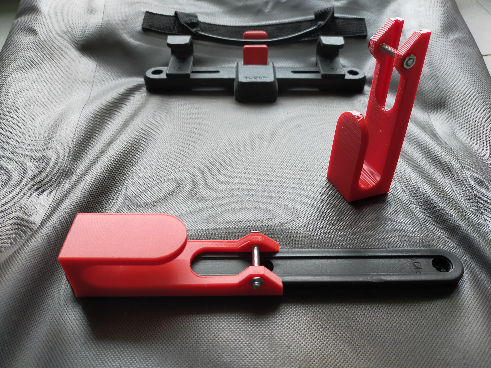
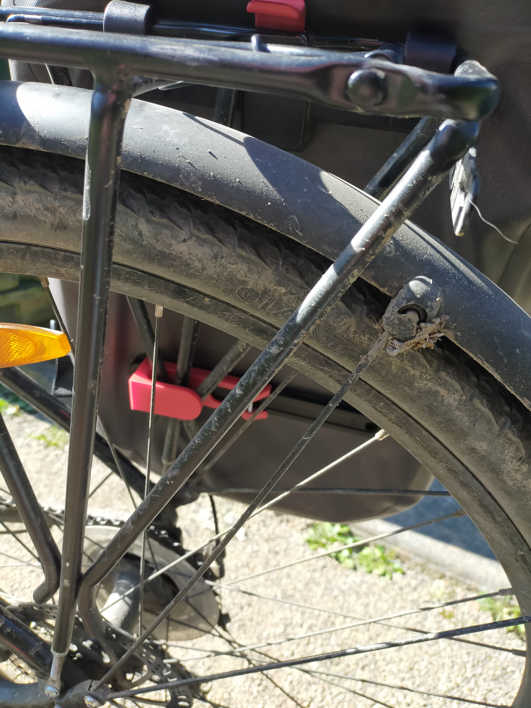

# Decathlon bike bag custom clamp

[![CC BY 4.0][cc-by-shield]][cc-by]

## Description

I am the owner of two bike bags bought at Decathlon, but as I have big feet,
I needed to put them as far as possible on my bicycle pannier rack.
Unfortunately the provided clamps whose purpose is to prevent the bags from
moving lateraly cannot be set completely on the edge of the provided rail and
I lost the two of them trying to do so.

The 3D model provided on this repository is a replacement part for these clamps
that can be placed as far as needed on the bags clamps rails.

## Pictures

On the bag                    | Bag on the bike                | Bag on the bike close-up
:----------------------------:|:------------------------------:|:-------------------------------------:|
  |   |  |

## Compatible bags

- Elops 900 27L.
- Btwin 900 25L Kompaktrail.
- Probably any Decathlon brand as the two mentionned bags are identical except for their colors.

## Needed supplies

- A 3D printer : to print the provided model.
- 4mm, 30mm long screws (diameter can be modified on the scad file).
- Associated bolts with external diameter 8mm (diameter can be modified on the scad file).

As I do not own a 3D printer myself, I used an online 3D-printing service such as [Treatstock](https://www.treatstock.com/) (not an affiliated link).
I printed mine in flexible TPU. The flexibility allows not to break even with heavy-loaded bags.

## License

I am not associated with Decathlon or any of its brands in any way.
I am just a bicycle enthusiast who needed to fix a design flaw on his bags.

This work is licensed under a
[Creative Commons Attribution 4.0 International License][cc-by].

[![CC BY 4.0][cc-by-image]][cc-by]

[cc-by]: http://creativecommons.org/licenses/by/4.0/
[cc-by-image]: https://i.creativecommons.org/l/by/4.0/88x31.png
[cc-by-shield]: https://img.shields.io/badge/License-CC%20BY%204.0-lightgrey.svg

